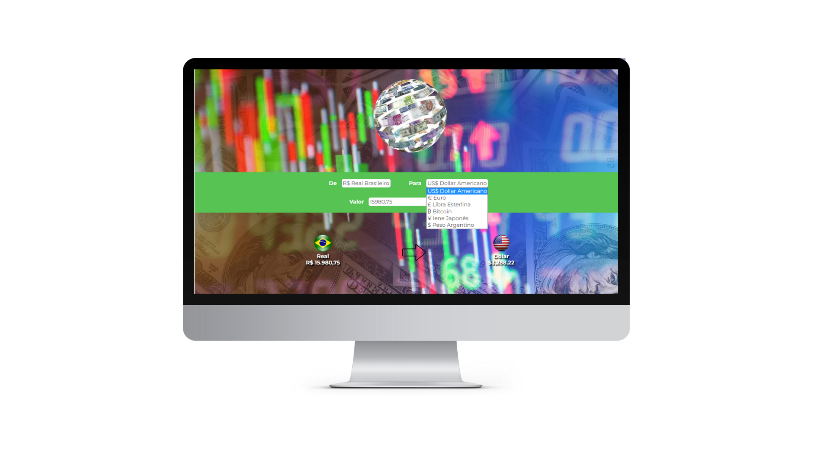

<h1 align="center" font-style="bolder">CONVERSOR DE MOEDAS</h1>
<h2>Esse foi um projeto com a inclusão de JavaScript</h2>

É um dos projetos de aula, que criei a partir do meu aprendizado.

Sempre focado em ser bem semântico e intuitivo com minhas hardskills, e trazendo uma boa experiência 
ao internauta.

Nele o visitante tem acesso a diversas moedas para converter com ajuda do JavaScript.

